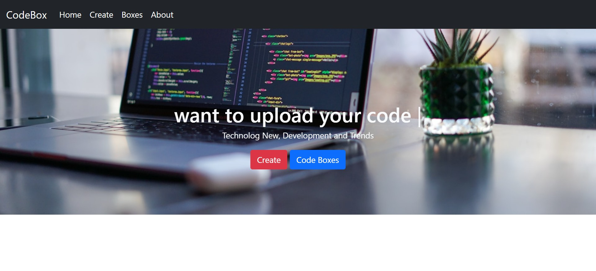
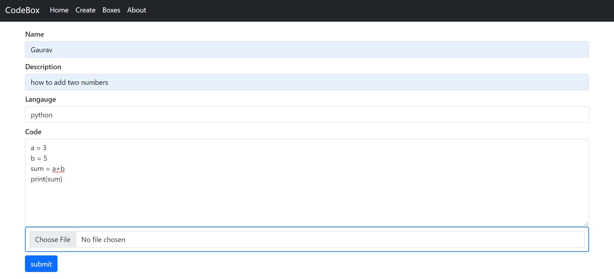
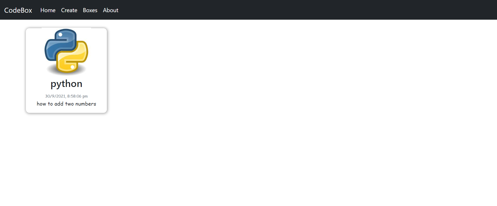
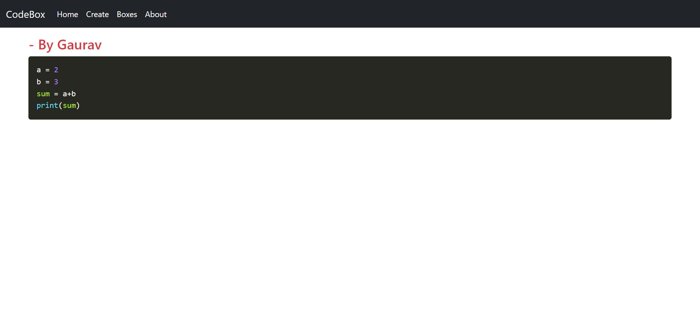

# Code Box

This is a website i used to push Code.

### Tools used:
- Nodejs
- EJs
- Express
- Mongo
- Typed.js
- prism.js


## Screenshots









## Installation

To install project run the command in the terminal

```
    npm i
```
```
    node app.js
```
    

## Features

- Code copy to clipboard button
- see others codeboxes


  